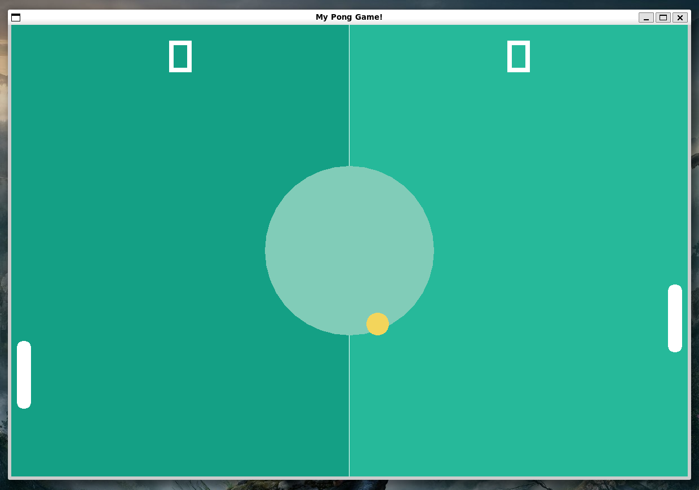

# Pong Game 🏓 (Remake) in C++

This is a remake of the classic Pong game, implemented in C++ using the [raylib](https://www.raylib.com/) library. In this version, you play against a computer-controlled opponent, trying to bounce the ball past the paddle controlled by the computer to score points.



## Features

- Single-player Pong gameplay against a computer-controlled opponent.
- Simple keyboard controls.
- Scoring to keep track of your progress.

## Prerequisites

Before running the game, you need to have [raylib](https://www.raylib.com/) installed on your system. Follow the installation instructions on the official raylib page.

## How to Run

1. Clone this repository to your system.
```
git clone https://github.com/Nyfeu/Pong.git
```
2. Navigate to the project directory.
3. Use GNU make to compile the game.
```
make
```
4. Run the game
```
make run
```

## Controls

- Player (You): KEY_UP (up), KEY_DOWN (down).
- Press ESC or close the window to exit the game.


## Inspiration

This project was inspired by Nick's programming tutorial, available on: [Youtube Video](https://www.youtube.com/watch?v=VLJlTaFvHo4). Nick's video was a valuable source of knowledge and inspiration for creating this Pong game in C++.

***
